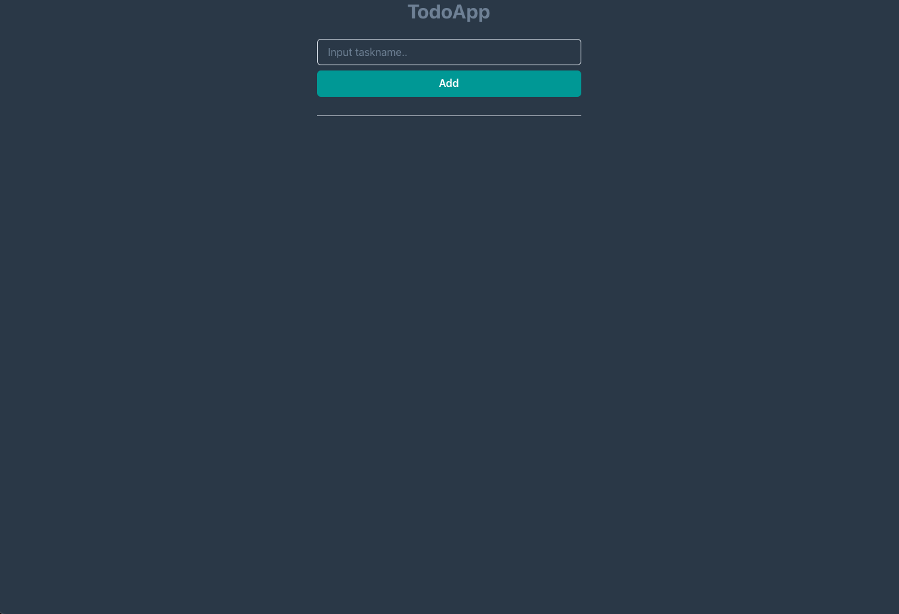

<style>
img[alt~="center"] {
  display: block;
  margin: 0 auto;
  width: 65%;
}
strong,b {
  color: red;
}
</style>

<!-- _class : lead invert-->

# 今日からはじめるコンテナ技術を
# 使ったWebサービスのつくりかた

I&I室　もりこ

---

# 自己紹介

* 名前：もりこ（ういち）
* I＆I室での役割：開発に関連する全て
* 趣味
  音楽：ギター（アコギもエレキも）、たまにライブ見に行く
  酒：日本酒、ビール

---

# 今回の目的

* モダンな技術に触れてもらう
* FastAPIとReactについて何となく理解できるようになる
* 自分たちの作りたいものがサーバレスで提供できるようになる

---

# 今回やらないこと

* Dockerのインストール方法
* コンテナ技術、FastAPI、Reactの詳しい説明
* コードの解説

---

<!-- _class : lead invert-->
# 座学（簡単に）

---

# はじめに

### 皆さんが普段使っている**アプリ**

### 気がついたらUIが変更されていたり、機能が追加されてませんか？

---

# 現在のWeb業界

競合他社が増え、魅力的なサービスをどこよりも速く提供することが求められるようになり、時代に応じて新しい開発手法や考え方、技術が用いられるようになりました。

    ex)アジャイル開発、スクラム、コンテナ技術、CI/CD、Kubernetes、マイクロサービス化etc

その中でコンテナ技術は、特にマストな技術と考えフォーカスを当てています。

---

# コンテナ技術とは

アプリケーションの実行に必要な環境を**コンテナ**という1つの塊にして、アプリケーションを実行すること。
導入している企業：
LINEヤフー、メルカリ、楽天モバイル、サイバーエージェント...etc

### なぜ学ぶのか

* 流行りの技術に触れてほしい
* 色んな企業で**採用されている**から

---

### メリット

* 可搬性
  * OSに依存しないので、どんな環境でも同じように実行ができる
    ※アーキテクチャには依存する
* CI/CDとの相性が良い
  * 実行環境がコンテナ化されるので、ブルーグリーンデプロイをしやすい

### デメリット

* 教育コスト高め

---

# システム構成

ゴールはこういう構成になります。


---

<!-- _class : lead invert-->
# 実習

---

# Todoアプリを立ち上げよう 1/6

* 以下のURLからソースをクローンしてくる
`git clone https://github.com/m8i-51/growing`

* プロジェクトのディレクトリに移動する
`cd growing`

---

# # Todoアプリを立ち上げよう 2/6
* 以下のファイルに実行権限を与える

  Linuxの人
`chmod +x project/backend/entrypoint.sh`

  Windowsの人（※動作未確認）
`icacls entrypoint.sh /g ユーザー名:RX`

* コンテナ達をビルド
`docker-compose up -d`

---

# Todoアプリを立ち上げよう 3/6

* コンテナが正常に起動しているか確認する
`docker-compose logs web`

実行結果↓

```log
web-1  | waiting for postgres server
web-1  | Connection Successfully
web-1  | INFO:     Uvicorn running on http://0.0.0.0:8000 (Press CTRL+C to quit)
web-1  | INFO:     Started reloader process [1] using statreload
web-1  | INFO:     Started server process [13]
web-1  | INFO:     Waiting for application startup.
web-1  | INFO:     Starting up...
web-1  | INFO:     Application startup complete.
web-1  | INFO:uvicorn.error:Application startup complete.
```

---

# Todoアプリを立ち上げよう 4/6

* 正常に起動されていたらテーブルを作成する
`docker-compose exec web python app/db.py`

※正常に動作していれば何も返って来ないはず

---

# Todoアプリを立ち上げよう 5/6

* テーブルが作成されたか確認する

```text
docker-compose exec web-db psql -U postgres

postgres-# postgres=\c dev_db

dev_db-# dev_db=\dt

           List of relations
Schema |    Name     | Type  |  Owner
--------+-------------+-------+----------
public | textsummary | table | postgres
(1 row)
```

---
# Todoアプリを立ち上げよう 6/6

これで準備が整いました。

* 以下のURLにアクセスするとTodoアプリが表示されるはず
`http://localhost:3007/`



---

<!-- _class : lead invert-->
# 課題

---

# 課題

これであなたはReact + FastAPI + PostgreSQLを用いたアプリ開発のスタートラインを切ることができました。

現状、Todoアプリにはタスクの編集と削除しか実装されていません。
そこで、みなさんには今から課題を出します。

---

# 課題(宿題)

* タスクの複製機能を実装


提出先：
**クローンしてきたリポジトリに自分のブランチを作成し提出**
###### みなさんのソース読ませてください

---

# 質疑・応答

何かありますか？

---

# 次回予告

### TodoアプリをAWSの各サービスを活用して公開

長くなるのでオンデマンド形式にしようと思ってます。(**鋭意製作中**)

---

<!-- _class : lead-->
# おつかれさまでした

